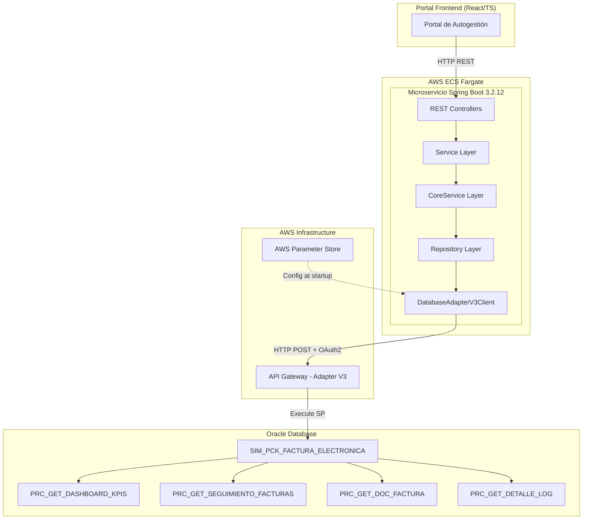
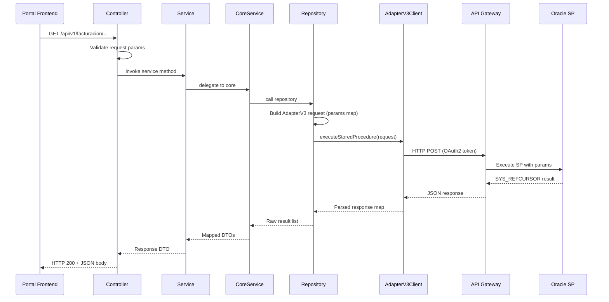

# Design Document: Facturación Electrónica Consulta

## Overview

Microservicio Java 17 / Spring Boot 3.2.12 que expone 4 endpoints REST de consulta para el Portal de Autogestión de Facturación Electrónica. El servicio consume procedimientos almacenados del paquete Oracle `SIM_PCK_FACTURA_ELECTRONICA` a través del patrón Adapter V3 (sin conexión JDBC directa).

El diseño sigue una arquitectura de capas estricta: Controller → Service → CoreService → Repository → DatabaseAdapterV3Client → API Gateway → Oracle SP. Cada capa tiene responsabilidades bien definidas y se comunica únicamente con la capa inmediatamente inferior.

Los 4 procedimientos retornan `SYS_REFCURSOR` como parámetro de salida, lo que permite un parseo uniforme de la respuesta del Adapter V3 como JSON array.

## Architecture

### High-Level Architecture Diagram



### Request Flow Sequence



## Components and Interfaces

### Package Structure

```
co.com.segurosbolivar.facturacionelectronica
├── FacturacionElectronicaApplication.java
├── config/
│   ├── OpenApiConfig.java
│   ├── SecurityHeadersFilter.java
│   └── DatabaseAdapterV3Properties.java
├── controller/
│   ├── DashboardController.java
│   ├── TrackerController.java
│   ├── DocumentoFacturaController.java
│   └── LogFacturaController.java
├── service/
│   ├── DashboardService.java
│   ├── TrackerService.java
│   ├── DocumentoFacturaService.java
│   └── LogFacturaService.java
├── core/
│   ├── DashboardCoreService.java
│   ├── TrackerCoreService.java
│   ├── DocumentoFacturaCoreService.java
│   └── LogFacturaCoreService.java
├── repository/
│   ├── DashboardRepository.java
│   ├── TrackerRepository.java
│   ├── DocumentoFacturaRepository.java
│   └── LogFacturaRepository.java
├── client/
│   └── DatabaseAdapterV3Client.java
├── dto/
│   ├── request/
│   │   ├── DashboardKpiRequest.java
│   │   ├── SeguimientoFacturasRequest.java
│   │   ├── DocumentoFacturaRequest.java
│   │   └── DetalleLogRequest.java
│   └── response/
│       ├── DashboardKpiResponse.java
│       ├── DistribucionEstadoResponse.java
│       ├── FacturaResumenResponse.java
│       ├── DocumentoFacturaResponse.java
│       ├── LogEntryResponse.java
│       └── PaginatedResponse.java
├── mapper/
│   ├── DashboardMapper.java
│   ├── FacturaMapper.java
│   ├── DocumentoFacturaMapper.java
│   └── LogMapper.java
├── exception/
│   ├── BolivarBusinessException.java
│   └── GlobalExceptionHandler.java
└── util/
    ├── ConstantsUtil.java
    └── PaginationUtil.java
```

### REST API Endpoints

| Endpoint | Method | Controller | SP |
|----------|--------|------------|-----|
| `/api/v1/facturacion/dashboard/kpis` | GET | DashboardController | PRC_GET_DASHBOARD_KPIS |
| `/api/v1/facturacion/tracker/facturas` | GET | TrackerController | PRC_GET_SEGUIMIENTO_FACTURAS |
| `/api/v1/facturacion/facturas/{idIntFac}` | GET | DocumentoFacturaController | PRC_GET_DOC_FACTURA |
| `/api/v1/facturacion/logs/{numSecuPol}` | GET | LogFacturaController | PRC_GET_DETALLE_LOG |

### Controller Layer

Each controller is responsible for:
1. Receiving and validating HTTP request parameters
2. Delegating to the corresponding Service
3. Returning the appropriate HTTP response code

```java
// DashboardController.java
@RestController
@RequestMapping("/api/v1/facturacion/dashboard")
@Tag(name = "Dashboard", description = "KPIs y métricas de facturación electrónica")
public class DashboardController {

    @Operation(summary = "Obtener KPIs del dashboard")
    @ApiResponse(responseCode = "200", description = "KPIs obtenidos exitosamente")
    @ApiResponse(responseCode = "400", description = "Parámetros de fecha inválidos")
    @GetMapping("/kpis")
    public ResponseEntity<DashboardKpiResponse> getKpis(
        @Parameter(description = "Fecha inicio (yyyy-MM-dd)", required = true)
        @RequestParam @DateTimeFormat(pattern = "yyyy-MM-dd") LocalDate fechaInicio,
        @Parameter(description = "Fecha fin (yyyy-MM-dd)", required = true)
        @RequestParam @DateTimeFormat(pattern = "yyyy-MM-dd") LocalDate fechaFin
    ) { ... }
}
```

```java
// TrackerController.java
@RestController
@RequestMapping("/api/v1/facturacion/tracker")
@Tag(name = "Tracker", description = "Búsqueda y seguimiento de facturas")
public class TrackerController {

    @GetMapping("/facturas")
    public ResponseEntity<PaginatedResponse<FacturaResumenResponse>> getFacturas(
        @RequestParam(required = false) String numPoliza,
        @RequestParam(required = false) @DateTimeFormat(pattern = "yyyy-MM-dd") LocalDate fechaInicio,
        @RequestParam(required = false) @DateTimeFormat(pattern = "yyyy-MM-dd") LocalDate fechaFin,
        @RequestParam(defaultValue = "0") int page,
        @RequestParam(defaultValue = "20") int size
    ) { ... }
}
```

```java
// DocumentoFacturaController.java
@RestController
@RequestMapping("/api/v1/facturacion/facturas")
@Tag(name = "Documento Factura", description = "Detalle de documento de factura")
public class DocumentoFacturaController {

    @GetMapping("/{idIntFac}")
    public ResponseEntity<DocumentoFacturaResponse> getDocumentoFactura(
        @PathVariable Long idIntFac
    ) { ... }
}
```

```java
// LogFacturaController.java
@RestController
@RequestMapping("/api/v1/facturacion/logs")
@Tag(name = "Logs", description = "Historial de logs y trazabilidad")
public class LogFacturaController {

    @GetMapping("/{numSecuPol}")
    public ResponseEntity<PaginatedResponse<LogEntryResponse>> getLogs(
        @PathVariable Long numSecuPol,
        @RequestParam(defaultValue = "0") int page,
        @RequestParam(defaultValue = "50") int size
    ) { ... }
}
```

### Service / CoreService Layer

- **Service**: Orchestration layer. Validates business rules (e.g., date range coherence), delegates to CoreService.
- **CoreService**: Calls Repository, maps raw results to DTOs using MapStruct mappers, applies pagination logic.

```java
// DashboardService.java
@Service
@RequiredArgsConstructor
public class DashboardService {
    private final DashboardCoreService coreService;

    public DashboardKpiResponse getKpis(LocalDate fechaInicio, LocalDate fechaFin) {
        validateDateRange(fechaInicio, fechaFin);
        return coreService.getKpis(fechaInicio, fechaFin);
    }
}
```

```java
// DashboardCoreService.java
@Service
@RequiredArgsConstructor
public class DashboardCoreService {
    private final DashboardRepository repository;
    private final DashboardMapper mapper;

    public DashboardKpiResponse getKpis(LocalDate fechaInicio, LocalDate fechaFin) {
        List<Map<String, Object>> rawResult = repository.getDashboardKpis(fechaInicio, fechaFin);
        return mapper.toKpiResponse(rawResult);
    }
}
```

### Repository Layer

Each repository builds the parameter map and invokes `DatabaseAdapterV3Client`:

```java
// DashboardRepository.java
@Repository
@RequiredArgsConstructor
public class DashboardRepository {
    private final DatabaseAdapterV3Client adapterClient;
    private final DatabaseAdapterV3Properties properties;

    public List<Map<String, Object>> getDashboardKpis(LocalDate fechaInicio, LocalDate fechaFin) {
        Map<String, Object> params = new LinkedHashMap<>();
        params.put(ConstantsUtil.IP_FECHA_INICIO, fechaInicio.format(properties.getDateFormatter()));
        params.put(ConstantsUtil.IP_FECHA_FIN, fechaFin.format(properties.getDateFormatter()));

        Map<String, Object> response = adapterClient.executeStoredProcedure(
            properties.getPackageName(),
            properties.getProcedures().getDashboardKpis(),
            params,
            ConstantsUtil.OP_CURSOR
        );

        return extractCursorResult(response);
    }
}
```

### DatabaseAdapterV3Client

Encapsulates HTTP communication with the Adapter V3 API Gateway:

```java
@Component
@RequiredArgsConstructor
public class DatabaseAdapterV3Client {
    private final RestTemplate restTemplate;
    private final DatabaseAdapterV3Properties properties;

    public Map<String, Object> executeStoredProcedure(
        String packageName,
        String procedureName,
        Map<String, Object> inputParams,
        String outputCursorParam
    ) {
        // Build request body with package, procedure, input params, output param
        // POST to Adapter V3 URL with OAuth2 Bearer token
        // Parse JSON response
        // Normalize keys to lowercase
        // Return parsed map
    }
}
```

## Data Models

### Request DTOs

```java
// DashboardKpiRequest.java
@Data
@Builder
public class DashboardKpiRequest {
    @NotNull private LocalDate fechaInicio;
    @NotNull private LocalDate fechaFin;
}

// SeguimientoFacturasRequest.java
@Data
@Builder
public class SeguimientoFacturasRequest {
    private String numPoliza;       // optional
    private LocalDate fechaInicio;  // optional (but paired with fechaFin)
    private LocalDate fechaFin;     // optional (but paired with fechaInicio)
    private int page;               // default 0
    private int size;               // default 20, max 100
}

// DocumentoFacturaRequest.java
@Data
@Builder
public class DocumentoFacturaRequest {
    @NotNull private Long idIntFac;
}

// DetalleLogRequest.java
@Data
@Builder
public class DetalleLogRequest {
    @NotNull private Long numSecuPol;
    private int page;   // default 0
    private int size;   // default 50, max 200
}
```

### Response DTOs

```java
// DashboardKpiResponse.java
@Data
@Builder
public class DashboardKpiResponse {
    private Long polizasEmitidas;
    private Long facturasExitosas;
    private Long facturasConError;
    private Long facturasPendientes;
    private BigDecimal valorTotalFacturado;
    private List<DistribucionEstadoResponse> distribucionEstados;
}

// DistribucionEstadoResponse.java
@Data
@Builder
public class DistribucionEstadoResponse {
    private String estado;
    private String descripcionEstado;
    private Long cantidad;
}

// FacturaResumenResponse.java
@Data
@Builder
public class FacturaResumenResponse {
    private Long idIntFac;
    private String numPoliza;
    private String fecha;
    private String estado;
    private String descripcionEstado;
    private BigDecimal totalAPagar;
    private String tipoDocAdquirente;
    private String numDocAdquirente;
    private String nombreAdquirente;
}

// DocumentoFacturaResponse.java
@Data
@Builder
public class DocumentoFacturaResponse {
    private Long idIntFac;
    private String estado;
    private String cufe;
    private String datosFaltantes;
    private String codigoMoneda;
    private BigDecimal primaProv;
    private BigDecimal importeImpuestosMonLocal;
    private BigDecimal tasaImpuesto;
    private BigDecimal totalAPagar;
    private BigDecimal importePrima;
    private Long idMvtoFact;
    // Additional fields from cursor
    private String numPoliza;
    private String nombreAdquirente;
    private String tipoDocAdquirente;
    private String numDocAdquirente;
}

// LogEntryResponse.java
@Data
@Builder
public class LogEntryResponse {
    private String tipoOperacion;
    private LocalDateTime timestamp;
    private String usuario;
    private String referenciaFactura;
    private String resultadoOperacion;
    private String detalle;
}

// PaginatedResponse.java
@Data
@Builder
public class PaginatedResponse<T> {
    private List<T> content;
    private long totalElements;
    private int totalPages;
    private int currentPage;
    private int pageSize;
}
```

### Configuration Properties

```java
// DatabaseAdapterV3Properties.java
@Data
@Configuration
@ConfigurationProperties(prefix = "adapter-v3")
public class DatabaseAdapterV3Properties {
    private String url;
    private String clientId;
    private String clientSecret;
    private String dateFormat = "yyyy-MM-dd";
    private String packageName = "SIM_PCK_FACTURA_ELECTRONICA";
    private Procedures procedures = new Procedures();

    @Data
    public static class Procedures {
        private String dashboardKpis = "PRC_GET_DASHBOARD_KPIS";
        private String seguimientoFacturas = "PRC_GET_SEGUIMIENTO_FACTURAS";
        private String docFactura = "PRC_GET_DOC_FACTURA";
        private String detalleLog = "PRC_GET_DETALLE_LOG";
    }

    public DateTimeFormatter getDateFormatter() {
        return DateTimeFormatter.ofPattern(dateFormat);
    }
}
```

### application.yml Structure

```yaml
server:
  port: 8080
  servlet:
    context-path: /facturacion-electronica
    encoding:
      charset: UTF-8
      enabled: true
      force: true

spring:
  application:
    name: facturacion-electronica-consulta

adapter-v3:
  url: ${ADAPTER_URL}
  client-id: ${ADAPTER_CLIENT_ID}
  client-secret: ${ADAPTER_CLIENT_SECRET}
  date-format: yyyy-MM-dd
  package-name: SIM_PCK_FACTURA_ELECTRONICA
  procedures:
    dashboard-kpis: PRC_GET_DASHBOARD_KPIS
    seguimiento-facturas: PRC_GET_SEGUIMIENTO_FACTURAS
    doc-factura: PRC_GET_DOC_FACTURA
    detalle-log: PRC_GET_DETALLE_LOG

management:
  health:
    db:
      enabled: false

springdoc:
  api-docs:
    path: /v3/api-docs
  swagger-ui:
    path: /swagger-ui.html
```

### Constants

```java
public final class ConstantsUtil {
    private ConstantsUtil() {}

    // Input parameters
    public static final String IP_FECHA_INICIO = "IP_FECHA_INICIO";
    public static final String IP_FECHA_FIN = "IP_FECHA_FIN";
    public static final String IP_NUM_POLIZA = "IP_NUM_POLIZA";
    public static final String IP_FECHA_INI = "IP_FECHA_INI";
    public static final String IP_ID_INT_FAC = "IP_ID_INT_FAC";
    public static final String IP_NUM_SECU_POL = "IP_NUM_SECU_POL";

    // Output parameters
    public static final String OP_CURSOR = "OP_CURSOR";
}
```


## Correctness Properties

*A property is a characteristic or behavior that should hold true across all valid executions of a system—essentially, a formal statement about what the system should do. Properties serve as the bridge between human-readable specifications and machine-verifiable correctness guarantees.*

### Property 1: KPI Mapping Preserves Aggregated Metrics

*For any* valid cursor result set containing invoice counts by estado and monetary totals, the DashboardMapper SHALL produce a DashboardKpiResponse where polizasEmitidas, facturasExitosas, facturasConError, facturasPendientes, and valorTotalFacturado correctly reflect the input data, AND the sum of all distribucionEstados counts equals the total number of records.

**Validates: Requirements 1.2, 1.3**

### Property 2: Invalid Date Range Rejection

*For any* pair of dates (fechaInicio, fechaFin) where fechaInicio is strictly after fechaFin, the validation logic SHALL reject the request, and for any pair where fechaInicio <= fechaFin, the validation SHALL accept the request.

**Validates: Requirements 1.5**

### Property 3: Paired Date Filter Validation

*For any* tracker request where exactly one of (fechaInicio, fechaFin) is provided and the other is null, the validation logic SHALL reject the request with a 400 error. When both are provided or both are null, validation SHALL pass.

**Validates: Requirements 2.7**

### Property 4: Factura Cursor-to-DTO Mapping

*For any* valid cursor result map containing invoice fields (numPoliza, fecha, estado, totalAPagar, tipoDocAdquirente, numDocAdquirente, nombreAdquirente), the FacturaMapper SHALL produce a FacturaResumenResponse with all fields correctly assigned from the source map, regardless of key casing.

**Validates: Requirements 2.2**

### Property 5: Documento Factura Cursor-to-DTO Mapping

*For any* valid cursor result map containing document fields (idIntFac, estado, cufe, datosFaltantes, codigoMoneda, primaProv, importeImpuestosMonLocal, tasaImpuesto, totalAPagar, importePrima, idMvtoFact), the DocumentoFacturaMapper SHALL produce a DocumentoFacturaResponse with all fields correctly assigned from the source map.

**Validates: Requirements 3.2**

### Property 6: Log Entry Mapping and Temporal Ordering

*For any* list of cursor result maps containing log entries with timestamps, the LogMapper SHALL produce a list of LogEntryResponse objects ordered by timestamp ascending, with all fields (tipoOperacion, timestamp, usuario, referenciaFactura, resultadoOperacion) correctly mapped.

**Validates: Requirements 4.2**

### Property 7: Pagination Size Clamping

*For any* requested page size value, the pagination logic SHALL clamp it to the configured maximum (100 for tracker, 200 for logs). If size <= 0, it SHALL use the default. If size > max, it SHALL use max. Otherwise it SHALL use the requested size.

**Validates: Requirements 2.4, 4.5**

### Property 8: Pagination Metadata Consistency

*For any* list of N elements and valid pagination parameters (page, size), the PaginatedResponse SHALL satisfy: totalElements == N, totalPages == ceil(N / pageSize), content.size() <= pageSize, currentPage == requested page, and if page >= totalPages then content is empty.

**Validates: Requirements 2.5, 4.6**

### Property 9: Date Formatting Consistency

*For any* valid LocalDate, formatting it with the configured DateTimeFormatter (yyyy-MM-dd) SHALL produce a string matching the pattern `\d{4}-\d{2}-\d{2}`, and parsing that string back SHALL produce the original LocalDate (round-trip).

**Validates: Requirements 5.6**

### Property 10: Cursor JSON Array Parsing

*For any* valid JSON array string representing cursor results, parsing it SHALL produce a List<Map<String, Object>> where the number of elements equals the array length, and each map contains all keys present in the corresponding JSON object.

**Validates: Requirements 5.7**

### Property 11: Business Error Detection

*For any* Adapter V3 response map containing an error indicator field, the error detection logic SHALL throw a BolivarBusinessException with TipoErrorEnum.NEGOCIO, preserving the error code and description from the response.

**Validates: Requirements 6.2**

### Property 12: Technical Exception Wrapping

*For any* exception thrown during Adapter V3 HTTP communication (RestClientException, JsonProcessingException, or any RuntimeException), the exception handling logic SHALL wrap it in a BolivarBusinessException with TipoErrorEnum.TECNICO, preserving the original error message.

**Validates: Requirements 6.3**

### Property 13: Response Key Normalization

*For any* Map<String, Object> with mixed-case keys, the normalization logic SHALL produce a new map where all keys are lowercase, all original values are preserved, and the map size remains unchanged (assuming no case-collision duplicates).

**Validates: Requirements 6.4**

## Error Handling

### Strategy

El microservicio utiliza `BolivarBusinessException` como excepción estándar del framework, clasificada por `TipoErrorEnum`:

| Tipo | Escenario | HTTP Status |
|------|-----------|-------------|
| NEGOCIO | Error retornado por el SP en el cursor (error de datos, regla de negocio) | 422 |
| TECNICO | Timeout, error de red, error de parseo JSON del Adapter V3 | 500 |
| — (Validation) | Parámetros faltantes o inválidos (fechas, IDs) | 400 |
| — (Not Found) | Cursor vacío en PRC_GET_DOC_FACTURA | 404 |

### GlobalExceptionHandler

```java
@RestControllerAdvice
public class GlobalExceptionHandler {

    @ExceptionHandler(BolivarBusinessException.class)
    public ResponseEntity<ErrorResponse> handleBolivarException(BolivarBusinessException ex) {
        if (ex.getTipoError() == TipoErrorEnum.NEGOCIO) {
            return ResponseEntity.status(422).body(buildError(ex));
        }
        return ResponseEntity.status(500).body(buildError(ex));
    }

    @ExceptionHandler(MethodArgumentNotValidException.class)
    public ResponseEntity<ErrorResponse> handleValidation(MethodArgumentNotValidException ex) {
        return ResponseEntity.badRequest().body(buildValidationError(ex));
    }

    @ExceptionHandler(MissingServletRequestParameterException.class)
    public ResponseEntity<ErrorResponse> handleMissingParam(MissingServletRequestParameterException ex) {
        return ResponseEntity.badRequest().body(buildMissingParamError(ex));
    }
}
```

### Error Response Structure

```java
@Data
@Builder
public class ErrorResponse {
    private String codigo;
    private String mensaje;
    private String tipoError;  // NEGOCIO | TECNICO
    private LocalDateTime timestamp;
}
```

### Key Normalization for Adapter V3 Responses

El Adapter V3 puede retornar keys en mayúsculas (OP_CURSOR) o minúsculas (op_cursor). El `DatabaseAdapterV3Client` normaliza todas las keys a lowercase antes de retornar el resultado:

```java
private Map<String, Object> normalizeKeys(Map<String, Object> response) {
    return response.entrySet().stream()
        .collect(Collectors.toMap(
            e -> e.getKey().toLowerCase(),
            Map.Entry::getValue,
            (v1, v2) -> v1
        ));
}
```

## Testing Strategy

### Unit Tests (JUnit 5 + Mockito)

- **Controllers**: MockMvc tests para validar HTTP status codes, request parameter validation, response structure.
- **Services**: Mock del CoreService, verificar delegación correcta y validaciones de negocio.
- **CoreServices**: Mock del Repository, verificar mapeo correcto de DTOs.
- **Repositories**: Mock del DatabaseAdapterV3Client, verificar construcción correcta de parámetros.
- **Mappers**: Tests directos de MapStruct mappers con datos de ejemplo.
- **PaginationUtil**: Tests de lógica de paginación con diferentes tamaños de lista.

### Property-Based Tests (JUnit 5 + jqwik 1.8.x)

La librería **jqwik** se utilizará para property-based testing en Java. Cada property test ejecutará mínimo 100 iteraciones.

Configuración en `build.gradle`:
```groovy
testImplementation 'net.jqwik:jqwik:1.8.5'
```

Properties a implementar:
1. **KPI Mapping** — Genera cursor results aleatorios, verifica consistencia de métricas y distribución.
2. **Date Range Validation** — Genera pares de fechas aleatorios, verifica aceptación/rechazo correcto.
3. **Paired Date Validation** — Genera combinaciones de fechas opcionales, verifica regla de pares.
4. **Factura Mapping** — Genera maps aleatorios con campos de factura, verifica mapeo correcto.
5. **Documento Factura Mapping** — Genera maps aleatorios con campos de documento, verifica mapeo.
6. **Log Entry Ordering** — Genera listas de log entries con timestamps aleatorios, verifica orden.
7. **Pagination Clamping** — Genera valores de size aleatorios, verifica clamping a máximo.
8. **Pagination Metadata** — Genera listas de tamaño aleatorio + params, verifica consistencia matemática.
9. **Date Formatting Round-Trip** — Genera LocalDates aleatorios, verifica format→parse = identidad.
10. **Cursor Parsing** — Genera JSON arrays aleatorios, verifica parseo correcto.
11. **Business Error Detection** — Genera responses con indicadores de error, verifica excepción NEGOCIO.
12. **Technical Exception Wrapping** — Genera excepciones aleatorias, verifica wrapping TECNICO.
13. **Key Normalization** — Genera maps con keys mixed-case, verifica lowercase + preservación de valores.

Cada test se etiquetará con:
```java
// Feature: facturacion-electronica-consulta, Property 8: Pagination Metadata Consistency
@Property(tries = 100)
@Tag("Feature: facturacion-electronica-consulta, Property 8: Pagination Metadata Consistency")
```

### Integration Tests

- Test de contexto Spring Boot (ApplicationContext loads)
- Test de SecurityHeadersFilter (headers presentes en respuestas)
- Test de OpenAPI spec generation (endpoints documentados)
- Test de encoding UTF-8 en respuestas

### Coverage

- JaCoCo 0.8.11 con umbral mínimo de 80% en líneas y ramas
- Exclusiones: DTOs (Lombok-generated), configuración, Application class
