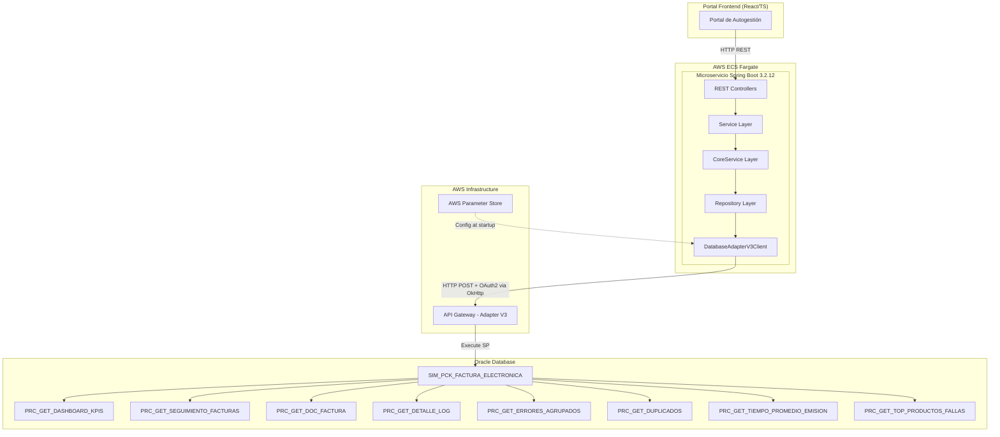
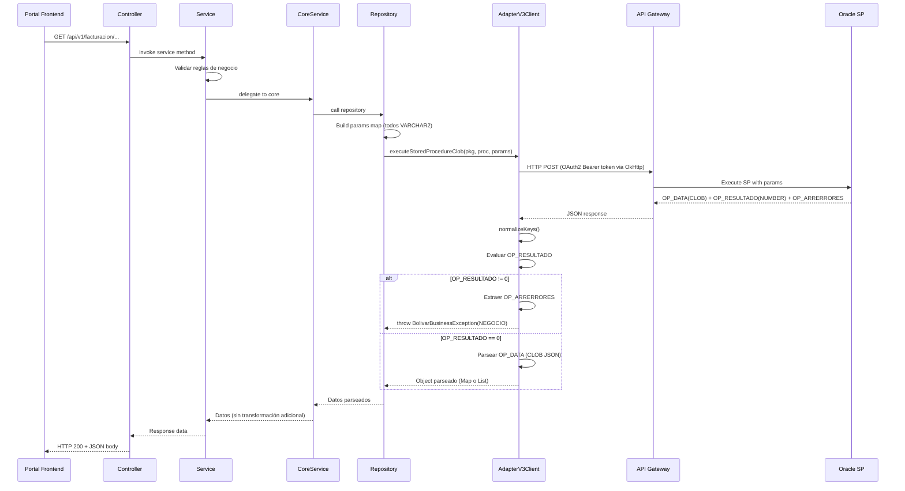
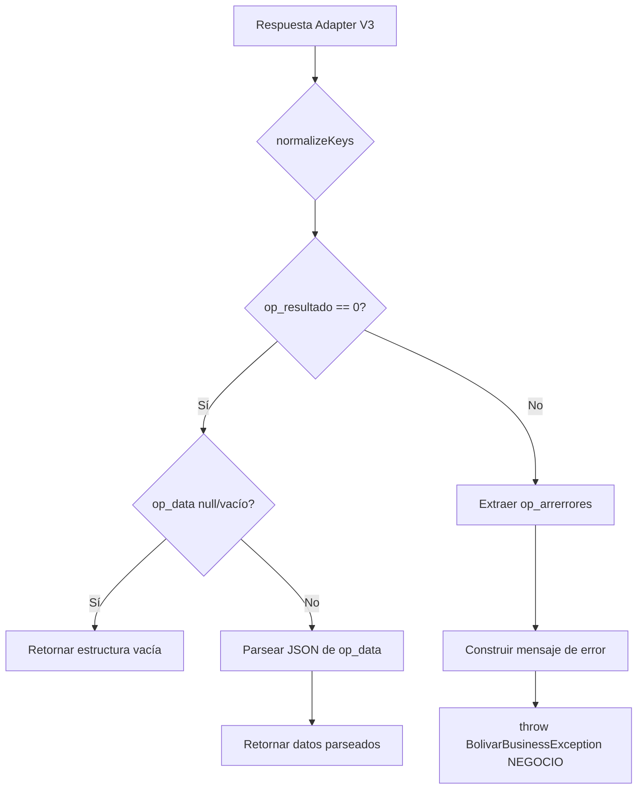

# Documento de Diseño: Facturación Electrónica V2

## Overview

Evolución del microservicio `facturacion-electronica-consulta` (Java 17 / Spring Boot 3.2.12) para adaptarse a los cambios en el paquete Oracle `SIM_PCK_FACTURA_ELECTRONICA`. Esta versión migra los 4 procedimientos existentes del patrón de salida `OP_CURSOR OUT SYS_REFCURSOR` al nuevo patrón de tres parámetros de salida (`OP_DATA OUT CLOB`, `OP_RESULTADO OUT NUMBER`, `OP_ARRERRORES OUT SIM_TYP_ARRAY_ERROR`) e incorpora 4 nuevos procedimientos analíticos.

### Cambios Principales

1. **Nuevo método en DatabaseAdapterV3Client**: `executeStoredProcedureClob()` que maneja el patrón OP_DATA/OP_RESULTADO/OP_ARRERRORES
2. **Paginación server-side para Tracker**: El SP `PRC_GET_SEGUIMIENTO_FACTURAS` ahora recibe `IP_PAGINA`/`IP_TAMANO` y retorna datos ya paginados
3. **Tipos de entrada actualizados**: Todos los parámetros de entrada son ahora VARCHAR2 (incluyendo IDs que antes eran Long)
4. **4 nuevos endpoints analíticos**: errores agrupados, duplicados, tiempo promedio de emisión, top productos con fallas

### Decisiones de Diseño

- **Se mantiene el enfoque simplificado** de retornar `Map<String, Object>` / `List<Map<String, Object>>` directamente desde los SPs, sin mapeo a DTOs tipados, ya que el SP retorna JSON estructurado en OP_DATA.
- **Se agrega un nuevo método** al `DatabaseAdapterV3Client` en lugar de modificar el existente, para mantener compatibilidad durante la transición.
- **Se elimina la paginación client-side** en TrackerCoreService (ya no se usa `PaginationUtil` para tracker).
- **Se mantiene la paginación client-side** para LogFacturaCoreService (el SP retorna todos los logs y se paginan en memoria).

## Architecture

### Diagrama de Arquitectura de Alto Nivel



### Flujo de Request (Nuevo Patrón CLOB)



## Components and Interfaces

### Estructura de Paquetes (V2)

```
co.com.segurosbolivar.facturacionelectronica
├── FacturacionElectronicaApplication.java
├── config/
│   ├── OpenApiConfig.java                    [MODIFICAR: version 2.0.0]
│   ├── SecurityHeadersFilter.java            [SIN CAMBIOS]
│   ├── RestTemplateConfig.java               [SIN CAMBIOS]
│   └── DatabaseAdapterV3Properties.java      [MODIFICAR: 4 nuevos procedures]
├── controller/
│   ├── DashboardController.java              [MODIFICAR: 4 nuevos endpoints]
│   ├── TrackerController.java                [MODIFICAR: nuevo param nroDocumento, paginación]
│   ├── DocumentoFacturaController.java       [MODIFICAR: pathVariable String]
│   └── LogFacturaController.java             [MODIFICAR: pathVariable String]
├── service/
│   ├── DashboardService.java                 [MODIFICAR: 4 nuevos métodos]
│   ├── TrackerService.java                   [MODIFICAR: nuevo param nroDocumento]
│   ├── DocumentoFacturaService.java          [MODIFICAR: param String]
│   └── LogFacturaService.java                [MODIFICAR: param String]
├── core/
│   ├── DashboardCoreService.java             [MODIFICAR: 4 nuevos métodos]
│   ├── TrackerCoreService.java               [MODIFICAR: eliminar PaginationUtil]
│   ├── DocumentoFacturaCoreService.java      [MODIFICAR: param String]
│   └── LogFacturaCoreService.java            [MODIFICAR: param String]
├── repository/
│   ├── DashboardRepository.java              [MODIFICAR: usar executeStoredProcedureClob]
│   ├── TrackerRepository.java                [MODIFICAR: nuevos params, executeStoredProcedureClob]
│   ├── DocumentoFacturaRepository.java       [MODIFICAR: param String, executeStoredProcedureClob]
│   ├── LogFacturaRepository.java             [MODIFICAR: param String, executeStoredProcedureClob]
│   ├── ErroresAgrupadosRepository.java       [NUEVO]
│   ├── DuplicadosRepository.java             [NUEVO]
│   ├── TiempoPromedioEmisionRepository.java  [NUEVO]
│   └── TopProductosFallasRepository.java     [NUEVO]
├── client/
│   └── DatabaseAdapterV3Client.java          [MODIFICAR: nuevo método executeStoredProcedureClob]
├── dto/
│   ├── request/ [SIN CAMBIOS SIGNIFICATIVOS]
│   └── response/
│       └── PaginatedResponse.java            [SIN CAMBIOS]
├── exception/
│   ├── BolivarBusinessException.java         [SIN CAMBIOS]
│   ├── ResourceNotFoundException.java        [SIN CAMBIOS]
│   ├── TipoErrorEnum.java                    [SIN CAMBIOS]
│   └── GlobalExceptionHandler.java           [SIN CAMBIOS]
└── util/
    ├── ConstantsUtil.java                    [MODIFICAR: nuevas constantes]
    └── PaginationUtil.java                   [SIN CAMBIOS]
```

### REST API Endpoints (V2 — 8 endpoints)

| Endpoint | Method | Controller | SP |
|----------|--------|------------|-----|
| `/api/v1/facturacion/dashboard/kpis` | GET | DashboardController | PRC_GET_DASHBOARD_KPIS |
| `/api/v1/facturacion/dashboard/errores-agrupados` | GET | DashboardController | PRC_GET_ERRORES_AGRUPADOS |
| `/api/v1/facturacion/dashboard/duplicados` | GET | DashboardController | PRC_GET_DUPLICADOS |
| `/api/v1/facturacion/dashboard/tiempo-promedio-emision` | GET | DashboardController | PRC_GET_TIEMPO_PROMEDIO_EMISION |
| `/api/v1/facturacion/dashboard/top-productos-fallas` | GET | DashboardController | PRC_GET_TOP_PRODUCTOS_FALLAS |
| `/api/v1/facturacion/tracker/facturas` | GET | TrackerController | PRC_GET_SEGUIMIENTO_FACTURAS |
| `/api/v1/facturacion/facturas/{idIntFac}` | GET | DocumentoFacturaController | PRC_GET_DOC_FACTURA |
| `/api/v1/facturacion/logs/{numSecuPol}` | GET | LogFacturaController | PRC_GET_DETALLE_LOG |

### DatabaseAdapterV3Client — Nuevo Método

```java
/**
 * Ejecuta un SP con el nuevo patrón de salida CLOB.
 * Extrae OP_DATA, evalúa OP_RESULTADO, y maneja OP_ARRERRORES.
 *
 * @return Object parseado del JSON en OP_DATA (puede ser Map o List)
 * @throws BolivarBusinessException si OP_RESULTADO != 0 o error de comunicación
 */
public Object executeStoredProcedureClob(
    String packageName,
    String procedureName,
    Map<String, Object> inputParams) {

    // 1. buildRequestBody (mismo formato que V1)
    // 2. HTTP POST via OkHttp con OAuth2 token
    // 3. normalizeKeys() en la respuesta
    // 4. Extraer op_resultado → si != 0, extraer op_arrerrores y lanzar BolivarBusinessException(NEGOCIO)
    // 5. Extraer op_data → parsear JSON string a Object (Map o List según contenido)
    // 6. Si op_data es null/vacío y op_resultado == 0, retornar estructura vacía
}
```

### Controller Layer (Cambios V2)

```java
// DashboardController.java — Se agregan 4 nuevos endpoints
@GetMapping("/errores-agrupados")
public ResponseEntity<Object> getErroresAgrupados(
    @RequestParam @DateTimeFormat(pattern = "yyyy-MM-dd") LocalDate fechaInicio,
    @RequestParam @DateTimeFormat(pattern = "yyyy-MM-dd") LocalDate fechaFin) { ... }

@GetMapping("/duplicados")
public ResponseEntity<Object> getDuplicados(
    @RequestParam @DateTimeFormat(pattern = "yyyy-MM-dd") LocalDate fechaInicio,
    @RequestParam @DateTimeFormat(pattern = "yyyy-MM-dd") LocalDate fechaFin) { ... }

@GetMapping("/tiempo-promedio-emision")
public ResponseEntity<Object> getTiempoPromedioEmision(
    @RequestParam @DateTimeFormat(pattern = "yyyy-MM-dd") LocalDate fechaInicio,
    @RequestParam @DateTimeFormat(pattern = "yyyy-MM-dd") LocalDate fechaFin) { ... }

@GetMapping("/top-productos-fallas")
public ResponseEntity<Object> getTopProductosFallas(
    @RequestParam @DateTimeFormat(pattern = "yyyy-MM-dd") LocalDate fechaInicio,
    @RequestParam @DateTimeFormat(pattern = "yyyy-MM-dd") LocalDate fechaFin,
    @RequestParam(defaultValue = "5") int topN) { ... }
```

```java
// TrackerController.java — Se agrega nroDocumento, se cambia paginación
@GetMapping("/facturas")
public ResponseEntity<Object> getFacturas(
    @RequestParam(required = false) String numPoliza,
    @RequestParam(required = false) String nroDocumento,  // NUEVO
    @RequestParam(required = false) @DateTimeFormat(pattern = "yyyy-MM-dd") LocalDate fechaInicio,
    @RequestParam(required = false) @DateTimeFormat(pattern = "yyyy-MM-dd") LocalDate fechaFin,
    @RequestParam(defaultValue = "1") int pagina,   // Cambia: 1-based para SP
    @RequestParam(defaultValue = "50") int tamano) { ... }
```

```java
// DocumentoFacturaController.java — pathVariable ahora String
@GetMapping("/{idIntFac}")
public ResponseEntity<Object> getDocumentoFactura(
    @PathVariable String idIntFac) { ... }
```

```java
// LogFacturaController.java — pathVariable ahora String
@GetMapping("/{numSecuPol}")
public ResponseEntity<Object> getLogs(
    @PathVariable String numSecuPol,
    @RequestParam(defaultValue = "0") int page,
    @RequestParam(defaultValue = "50") int size) { ... }
```

### Repository Layer (Ejemplo — ErroresAgrupadosRepository)

```java
@Repository
@RequiredArgsConstructor
public class ErroresAgrupadosRepository {

    private final DatabaseAdapterV3Client adapterClient;
    private final DatabaseAdapterV3Properties properties;

    public Object getErroresAgrupados(LocalDate fechaInicio, LocalDate fechaFin) {
        Map<String, Object> params = new LinkedHashMap<>();
        params.put(ConstantsUtil.IP_FECHA_INICIO, fechaInicio.format(properties.getDateFormatter()));
        params.put(ConstantsUtil.IP_FECHA_FIN, fechaFin.format(properties.getDateFormatter()));

        return adapterClient.executeStoredProcedureClob(
                properties.getPackageName(),
                properties.getProcedures().getErroresAgrupados(),
                params
        );
    }
}
```

### TrackerRepository (Actualizado V2)

```java
@Repository
@RequiredArgsConstructor
public class TrackerRepository {

    private final DatabaseAdapterV3Client adapterClient;
    private final DatabaseAdapterV3Properties properties;

    public Object getSeguimientoFacturas(String numPoliza, String nroDocumento,
                                         LocalDate fechaInicio, LocalDate fechaFin,
                                         int pagina, int tamano) {
        Map<String, Object> params = new LinkedHashMap<>();
        params.put(ConstantsUtil.IP_NUM_POLIZA, numPoliza);       // null si no se envía
        params.put(ConstantsUtil.IP_NRO_DOCUMENTO, nroDocumento); // null si no se envía
        if (fechaInicio != null) {
            params.put(ConstantsUtil.IP_FECHA_INICIO, fechaInicio.format(properties.getDateFormatter()));
        }
        if (fechaFin != null) {
            params.put(ConstantsUtil.IP_FECHA_FIN, fechaFin.format(properties.getDateFormatter()));
        }
        params.put(ConstantsUtil.IP_PAGINA, pagina);
        params.put(ConstantsUtil.IP_TAMANO, tamano);

        return adapterClient.executeStoredProcedureClob(
                properties.getPackageName(),
                properties.getProcedures().getSeguimientoFacturas(),
                params
        );
    }
}
```

## Data Models

### Constantes Actualizadas (ConstantsUtil.java)

```java
public final class ConstantsUtil {
    private ConstantsUtil() {}

    // Input parameters (existentes)
    public static final String IP_FECHA_INICIO = "IP_FECHA_INICIO";
    public static final String IP_FECHA_FIN = "IP_FECHA_FIN";
    public static final String IP_NUM_POLIZA = "IP_NUM_POLIZA";
    public static final String IP_ID_INT_FAC = "IP_ID_INT_FAC";
    public static final String IP_NUM_SECU_POL = "IP_NUM_SECU_POL";

    // Input parameters (nuevos V2)
    public static final String IP_NRO_DOCUMENTO = "IP_NRO_DOCUMENTO";
    public static final String IP_PAGINA = "IP_PAGINA";
    public static final String IP_TAMANO = "IP_TAMANO";
    public static final String IP_TOP_N = "IP_TOP_N";

    // Output parameters (V1 — se mantiene para compatibilidad)
    public static final String OP_CURSOR = "OP_CURSOR";

    // Output parameters (nuevos V2)
    public static final String OP_DATA = "op_data";
    public static final String OP_RESULTADO = "op_resultado";
    public static final String OP_ARRERRORES = "op_arrerrores";
}
```

> **Nota**: Las constantes de salida se definen en minúsculas porque se usan después de `normalizeKeys()`.

### DatabaseAdapterV3Properties (Actualizado)

```java
@Data
@Configuration
@ConfigurationProperties(prefix = "app.adapter.v3")
public class DatabaseAdapterV3Properties {

    private String baseUrl;
    private String adapterPath = "/api/v3/database/adapter";
    private String ejecutor = "ejecutor_tronador";
    private String clientId;
    private String clientSecret;
    private String owner = "OPS$PUMA";
    private String channel;
    private String channelOperation;
    private int timeoutSeconds = 30;
    private String dateFormat = "yyyy-MM-dd";
    private String packageName = "SIM_PCK_FACTURA_ELECTRONICA";
    private Procedures procedures = new Procedures();

    @Data
    public static class Procedures {
        // Existentes
        private String dashboardKpis = "PRC_GET_DASHBOARD_KPIS";
        private String seguimientoFacturas = "PRC_GET_SEGUIMIENTO_FACTURAS";
        private String docFactura = "PRC_GET_DOC_FACTURA";
        private String detalleLog = "PRC_GET_DETALLE_LOG";
        // Nuevos V2
        private String erroresAgrupados = "PRC_GET_ERRORES_AGRUPADOS";
        private String duplicados = "PRC_GET_DUPLICADOS";
        private String tiempoPromedioEmision = "PRC_GET_TIEMPO_PROMEDIO_EMISION";
        private String topProductosFallas = "PRC_GET_TOP_PRODUCTOS_FALLAS";
    }

    public DateTimeFormatter getDateFormatter() {
        return DateTimeFormatter.ofPattern(dateFormat);
    }

    public String getFullUrl() {
        return baseUrl + "/" + ejecutor + adapterPath;
    }
}
```

### application.yml (Actualizado)

```yaml
app:
  adapter:
    v3:
      base-url: ${ADAPTER_URL:https://4tldca0v35.execute-api.us-east-1.amazonaws.com/dev}
      adapter-path: /api/v3/database/adapter
      ejecutor: ejecutor_tronador
      client-id: ${ADAPTER_CLIENT_ID}
      client-secret: ${ADAPTER_CLIENT_SECRET}
      owner: OPS$PUMA
      channel: ${ADAPTER_CHANNEL:facturacion-electronica-consulta}
      channel-operation: ${ADAPTER_CHANNEL_OPERATION:consulta-facturacion}
      timeout-seconds: 30
      date-format: yyyy-MM-dd
      package-name: SIM_PCK_FACTURA_ELECTRONICA
      procedures:
        dashboard-kpis: PRC_GET_DASHBOARD_KPIS
        seguimiento-facturas: PRC_GET_SEGUIMIENTO_FACTURAS
        doc-factura: PRC_GET_DOC_FACTURA
        detalle-log: PRC_GET_DETALLE_LOG
        errores-agrupados: PRC_GET_ERRORES_AGRUPADOS
        duplicados: PRC_GET_DUPLICADOS
        tiempo-promedio-emision: PRC_GET_TIEMPO_PROMEDIO_EMISION
        top-productos-fallas: PRC_GET_TOP_PRODUCTOS_FALLAS
```

### Formato de Request al Adapter V3 (sin cambios)

```json
{
    "ejecutor": "ejecutor_tronador",
    "owner": "OPS$PUMA",
    "package": "SIM_PCK_FACTURA_ELECTRONICA",
    "procedure": "PRC_GET_ERRORES_AGRUPADOS",
    "parameters": {
        "IP_FECHA_INICIO": "2025-01-01",
        "IP_FECHA_FIN": "2025-06-01"
    }
}
```

### Formato de Respuesta del Adapter V3 (Nuevo Patrón CLOB)

```json
{
    "OP_DATA": "[{\"codigo_error\":\"ERR001\",\"descripcion\":\"Timeout DIAN\",\"cantidad\":45}]",
    "OP_RESULTADO": 0,
    "OP_ARRERRORES": null
}
```

Cuando hay error (`OP_RESULTADO != 0`):
```json
{
    "OP_DATA": null,
    "OP_RESULTADO": 1,
    "OP_ARRERRORES": [
        {"codigo": "ERR_FECHA", "descripcion": "Rango de fechas inválido"}
    ]
}
```

### Lógica del Nuevo Método `executeStoredProcedureClob`

```java
public Object executeStoredProcedureClob(
        String packageName, String procedureName,
        Map<String, Object> inputParams) {

    // 1. Build request body (idéntico a V1)
    Map<String, Object> requestBody = buildRequestBody(packageName, procedureName, inputParams);
    String jsonBody = objectMapper.writeValueAsString(requestBody);
    String token = getOAuth2Token();

    // 2. HTTP POST via OkHttp
    Request request = new Request.Builder()
            .url(properties.getFullUrl())
            .post(RequestBody.create(jsonBody, MediaType.parse("application/json; charset=utf-8")))
            .addHeader("Authorization", "Bearer " + token)
            .addHeader("channel", properties.getChannel())
            .addHeader("channel_operation", properties.getChannelOperation())
            .build();

    // 3. Parsear respuesta y normalizar keys
    Map<String, Object> normalized = normalizeKeys(responseMap);

    // 4. Evaluar OP_RESULTADO
    Object resultado = normalized.get(ConstantsUtil.OP_RESULTADO);
    int resultCode = (resultado instanceof Number) ? ((Number) resultado).intValue() : -1;

    if (resultCode != 0) {
        // 5. Extraer OP_ARRERRORES y lanzar excepción
        Object errores = normalized.get(ConstantsUtil.OP_ARRERRORES);
        String errorMsg = buildErrorMessage(errores);
        throw new BolivarBusinessException(TipoErrorEnum.NEGOCIO, "SP_ERROR_" + resultCode, errorMsg);
    }

    // 6. Extraer y parsear OP_DATA
    Object opData = normalized.get(ConstantsUtil.OP_DATA);
    if (opData == null || (opData instanceof String && ((String) opData).isBlank())) {
        return Collections.emptyList();
    }

    if (opData instanceof String) {
        String json = (String) opData;
        // Determinar si es array o objeto
        json = json.trim();
        if (json.startsWith("[")) {
            return objectMapper.readValue(json, new TypeReference<List<Map<String, Object>>>() {});
        } else {
            return objectMapper.readValue(json, new TypeReference<Map<String, Object>>() {});
        }
    }

    // Si ya viene parseado (List o Map), retornar directamente
    return opData;
}
```


## Correctness Properties

*Una propiedad es una característica o comportamiento que debe mantenerse verdadero en todas las ejecuciones válidas de un sistema — esencialmente, una declaración formal sobre lo que el sistema debe hacer. Las propiedades sirven como puente entre especificaciones legibles por humanos y garantías de corrección verificables por máquina.*

### Property 1: Parseo Round-Trip de OP_DATA (CLOB JSON)

*Para cualquier* JSON string válido (ya sea un array JSON o un objeto JSON), si se coloca como valor del campo `op_data` en un mapa de respuesta normalizado y se invoca la lógica de parseo de `executeStoredProcedureClob`, el resultado parseado debe ser estructuralmente equivalente al JSON original — arrays producen `List<Map<String, Object>>` y objetos producen `Map<String, Object>`.

**Validates: Requirements 1.1, 1.5, 2.2, 4.2, 5.2, 6.2, 7.2, 8.2, 9.3**

### Property 2: Evaluación de OP_RESULTADO y Propagación de Errores

*Para cualquier* valor numérico de `op_resultado`: si es 0, la ejecución debe completarse exitosamente retornando los datos de `op_data`; si es distinto de 0, debe lanzarse una `BolivarBusinessException` con `TipoErrorEnum.NEGOCIO` conteniendo el código de resultado y los mensajes extraídos de `op_arrerrores`.

**Validates: Requirements 1.2, 1.3, 11.1, 11.2**

### Property 3: Normalización de Claves a Minúsculas

*Para cualquier* `Map<String, Object>` con claves en casing mixto (mayúsculas, minúsculas, CamelCase), la función `normalizeKeys` debe producir un mapa donde todas las claves son lowercase, todos los valores originales se preservan, y el tamaño del mapa no cambia (asumiendo que no hay colisiones de casing).

**Validates: Requirements 1.4, 11.4**

### Property 4: Formateo de Fechas Round-Trip (yyyy-MM-dd)

*Para cualquier* `LocalDate` válido, formatearlo con el `DateTimeFormatter` configurado (patrón `yyyy-MM-dd`) debe producir un string que coincida con el patrón `\d{4}-\d{2}-\d{2}`, y parsear ese string de vuelta debe producir el `LocalDate` original.

**Validates: Requirements 2.1, 3.2, 6.1, 7.1, 8.1, 9.1, 10.4**

### Property 5: Validación de Rango de Fechas

*Para cualquier* par de fechas `(fechaInicio, fechaFin)`: si `fechaInicio` es estrictamente posterior a `fechaFin`, la validación debe rechazar la solicitud lanzando `IllegalArgumentException`; si `fechaInicio <= fechaFin`, la validación debe aceptar la solicitud.

**Validates: Requirements 2.5, 6.5, 7.5, 8.5, 9.6**

### Property 6: Validación de Fechas Pareadas

*Para cualquier* combinación de valores opcionales `(fechaInicio, fechaFin)` en el tracker: si exactamente uno de los dos es proporcionado y el otro es null, la validación debe rechazar la solicitud con HTTP 400; cuando ambos son proporcionados o ambos son null, la validación debe pasar.

**Validates: Requirements 3.8**

### Property 7: Pass-Through de Paginación Server-Side al SP (Tracker)

*Para cualquier* combinación de parámetros de paginación `(pagina, tamano)` enviados al endpoint del tracker, el repositorio debe pasar estos valores directamente al `DatabaseAdapterV3Client` como `IP_PAGINA` e `IP_TAMANO` sin transformación, y el resultado de `OP_DATA` debe retornarse sin aplicar paginación client-side adicional.

**Validates: Requirements 3.1, 3.4, 3.5**

### Property 8: Validación de IP_TOP_N como Entero Positivo

*Para cualquier* valor entero de `topN`: si es menor o igual a 0, la validación debe rechazar la solicitud con HTTP 400; si es mayor que 0, la validación debe aceptar la solicitud y pasar el valor al SP.

**Validates: Requirements 9.7**

### Property 9: Wrapping de Excepciones Técnicas

*Para cualquier* excepción lanzada durante la comunicación HTTP con el Adapter V3 (IOException, JsonProcessingException, RuntimeException), la lógica de manejo de errores debe envolverla en una `BolivarBusinessException` con `TipoErrorEnum.TECNICO`, preservando el mensaje de error original.

**Validates: Requirements 11.3**

### Property 10: Consistencia de Metadatos de Paginación Client-Side (Logs)

*Para cualquier* lista de N elementos y parámetros de paginación válidos `(page, size)` con máximo 200, el `PaginatedResponse` debe satisfacer: `totalElements == N`, `totalPages == ceil(N / pageSize)`, `content.size() <= pageSize`, `currentPage == page solicitado`, y si `page >= totalPages` entonces `content` es vacío.

**Validates: Requirements 5.5**

## Error Handling

### Estrategia

El microservicio utiliza el mismo `GlobalExceptionHandler` existente con las siguientes clasificaciones:

| Tipo | Escenario | HTTP Status |
|------|-----------|-------------|
| NEGOCIO | OP_RESULTADO != 0 → OP_ARRERRORES extraído del SP | 422 Unprocessable Entity |
| TECNICO | Timeout, error de red, error de parseo JSON del Adapter V3 | 500 Internal Server Error |
| VALIDACION | Parámetros faltantes o inválidos (fechas, IDs, topN) | 400 Bad Request |
| NOT_FOUND | OP_DATA vacío en PRC_GET_DOC_FACTURA | 404 Not Found |

### Flujo de Errores con Nuevo Patrón



### Construcción del Mensaje de Error desde OP_ARRERRORES

```java
private String buildErrorMessage(Object errores) {
    if (errores == null) {
        return "Error de negocio retornado por el SP (sin detalle)";
    }
    if (errores instanceof List) {
        List<?> errorList = (List<?>) errores;
        return errorList.stream()
            .filter(e -> e instanceof Map)
            .map(e -> {
                Map<?, ?> errorMap = (Map<?, ?>) e;
                String codigo = String.valueOf(errorMap.getOrDefault("codigo", ""));
                String desc = String.valueOf(errorMap.getOrDefault("descripcion", ""));
                return codigo + ": " + desc;
            })
            .collect(Collectors.joining("; "));
    }
    return String.valueOf(errores);
}
```

### Manejo de OP_DATA Vacío por Endpoint

| Endpoint | Comportamiento con OP_DATA vacío |
|----------|----------------------------------|
| Dashboard KPIs | HTTP 200, objeto con valores en cero |
| Tracker | HTTP 200, array vacío con totalElements=0 |
| Documento Factura | HTTP 404, ResourceNotFoundException |
| Logs | HTTP 200, array vacío |
| Errores Agrupados | HTTP 200, array vacío |
| Duplicados | HTTP 200, array vacío |
| Tiempo Promedio | HTTP 200, objeto con valores en cero |
| Top Productos | HTTP 200, array vacío |

## Testing Strategy

### Unit Tests (JUnit 5 + Mockito)

- **Controllers**: MockMvc tests para validar HTTP status codes, validación de parámetros, estructura de respuesta.
- **Services**: Mock del CoreService, verificar delegación correcta y validaciones de negocio (rango de fechas, fechas pareadas, topN).
- **CoreServices**: Mock del Repository, verificar pass-through correcto de datos.
- **Repositories**: Mock del DatabaseAdapterV3Client, verificar construcción correcta de parámetros (todos como String/VARCHAR2).
- **DatabaseAdapterV3Client**: Mock de OkHttpClient, verificar parseo de OP_DATA, evaluación de OP_RESULTADO, extracción de OP_ARRERRORES.

### Property-Based Tests (JUnit 5 + jqwik 1.8.x)

La librería **jqwik** se utilizará para property-based testing en Java. Cada property test ejecutará mínimo 100 iteraciones.

Configuración en `build.gradle`:
```groovy
testImplementation 'net.jqwik:jqwik:1.8.5'
```

Properties a implementar:

1. **OP_DATA CLOB Parsing** — Genera JSON strings aleatorios (arrays y objetos), verifica parseo correcto a List/Map.
   - Tag: `Feature: facturacion-electronica-v2, Property 1: Parseo Round-Trip de OP_DATA (CLOB JSON)`

2. **OP_RESULTADO Evaluation** — Genera valores numéricos aleatorios con arrays de errores, verifica comportamiento correcto (éxito vs excepción).
   - Tag: `Feature: facturacion-electronica-v2, Property 2: Evaluación de OP_RESULTADO y Propagación de Errores`

3. **Key Normalization** — Genera maps con keys en casing mixto, verifica lowercase + preservación de valores.
   - Tag: `Feature: facturacion-electronica-v2, Property 3: Normalización de Claves a Minúsculas`

4. **Date Formatting Round-Trip** — Genera LocalDates aleatorios, verifica format→parse = identidad.
   - Tag: `Feature: facturacion-electronica-v2, Property 4: Formateo de Fechas Round-Trip (yyyy-MM-dd)`

5. **Date Range Validation** — Genera pares de fechas aleatorios, verifica aceptación/rechazo correcto.
   - Tag: `Feature: facturacion-electronica-v2, Property 5: Validación de Rango de Fechas`

6. **Paired Date Validation** — Genera combinaciones de fechas opcionales, verifica regla de pares.
   - Tag: `Feature: facturacion-electronica-v2, Property 6: Validación de Fechas Pareadas`

7. **Tracker Pagination Pass-Through** — Genera valores de paginación aleatorios, verifica que se pasan sin transformación al SP.
   - Tag: `Feature: facturacion-electronica-v2, Property 7: Pass-Through de Paginación Server-Side al SP (Tracker)`

8. **TopN Validation** — Genera enteros aleatorios, verifica rechazo cuando <= 0 y aceptación cuando > 0.
   - Tag: `Feature: facturacion-electronica-v2, Property 8: Validación de IP_TOP_N como Entero Positivo`

9. **Technical Exception Wrapping** — Genera excepciones aleatorias, verifica wrapping en BolivarBusinessException TECNICO.
   - Tag: `Feature: facturacion-electronica-v2, Property 9: Wrapping de Excepciones Técnicas`

10. **Client-Side Pagination Metadata** — Genera listas de tamaño aleatorio + params, verifica consistencia matemática del PaginatedResponse.
    - Tag: `Feature: facturacion-electronica-v2, Property 10: Consistencia de Metadatos de Paginación Client-Side (Logs)`

### Integration Tests

- Test de contexto Spring Boot (ApplicationContext loads con nueva configuración)
- Test de SecurityHeadersFilter (headers presentes en respuestas)
- Test de OpenAPI spec generation (8 endpoints documentados)
- Test de encoding UTF-8 en respuestas
- Test end-to-end con WireMock simulando el Adapter V3 (nuevo patrón CLOB)

### Coverage

- JaCoCo 0.8.11 con umbral mínimo de 80% en líneas y ramas
- Exclusiones: DTOs (Lombok-generated), configuración, Application class
